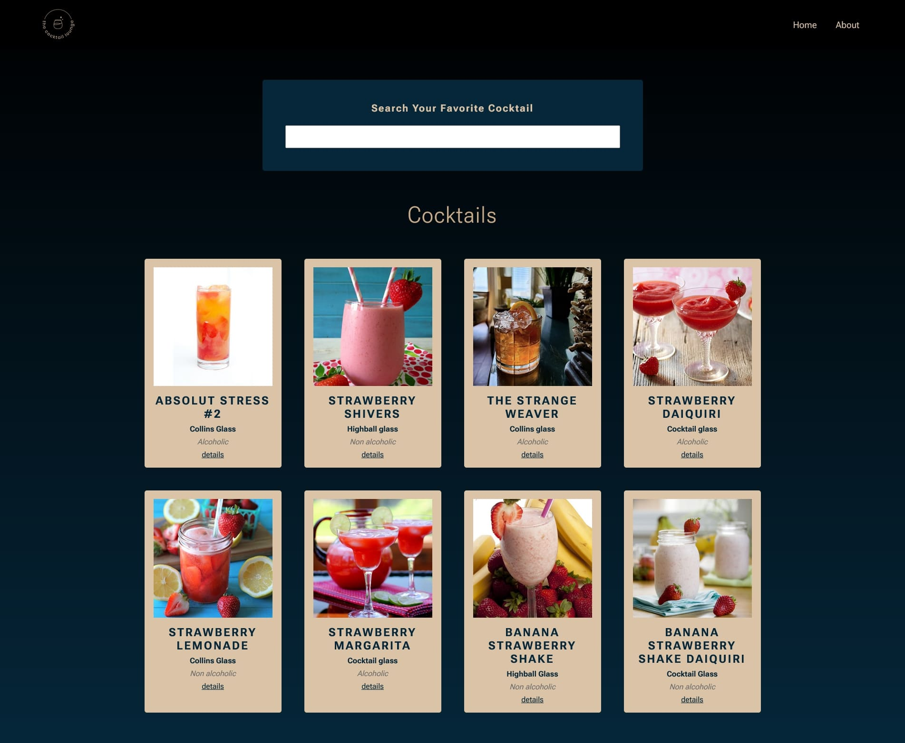

# The Cocktail Lounge

## Built with

- React
- Context API
- React Router 6
- Fetch API
- React Hooks (useState, useEffect, useCallback)
- CSS
- Vite
- Responsive Design

## Users should be able to:

- Search for cocktails by typing keywords into the search input
- View a list of cocktails that match their search query
- Click on a specific cocktail to view its details page
- View the cocktail's name, image, ingredients, and instructions on the details page
- Return to the search results page or search for a new cocktail from the details page
- Navigate the website easily and intuitively using clear and consistent navigation elements
- Enjoy a visually appealing and responsive design that works well on both desktop and mobile devices
- Have a seamless and enjoyable experience browsing and discovering new cocktail recipes.

## Links

- Live Site URL: [The Cocktail Lounge](https://magic-memory-game-tekizashvili.netlify.app/)
